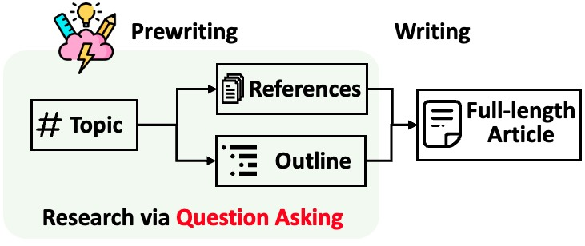
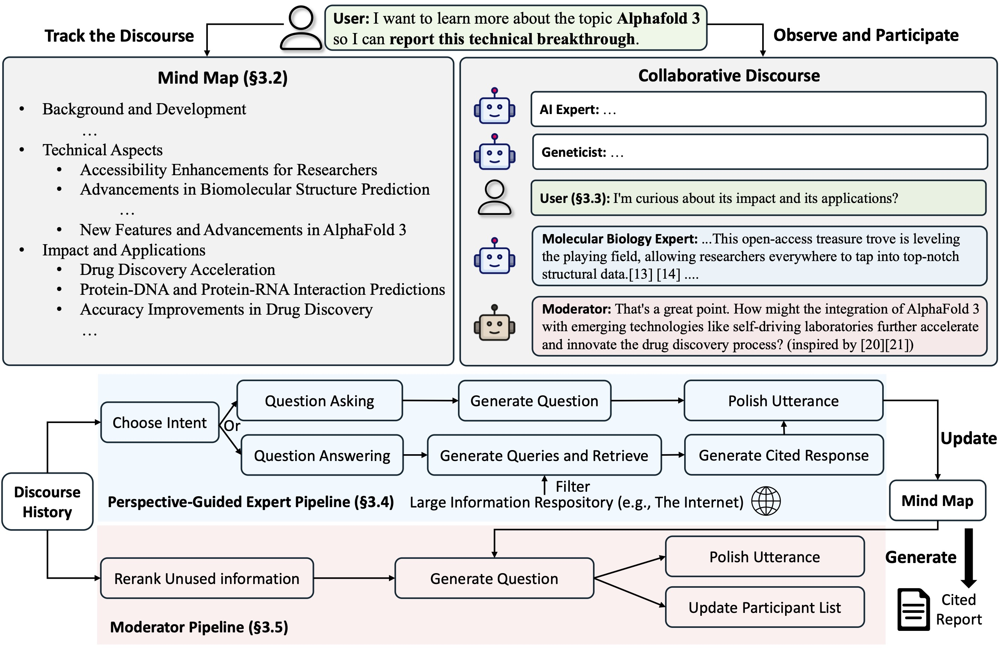

# Citewise

<p align="center">
  
</p>

# CiteWise AI: the integration of topic outlines via retrieval and multiple-perspective questioning.

## Overview 

<p align="center">
  
</p>
Citewise AI is a LLM system that writes Wikipedia-like articles from scratch based on Internet search. Lunarrot further enhanced its feature by enabling human to collaborative LLM system to support more aligned and preferred information seeking and knowledge curation.

While the system cannot produce publication-ready articles that often require a significant number of edits, experienced Wikipedia editors have found it helpful in their pre-writing stage.


## How CiteWise & Lunarrot works

### Citewise

Citewise breaks down generating long articles with citations into two steps:

1. **Pre-writing stage**: The system conducts Internet-based research to collect references and generates an outline.
2. **Writing stage**: The system uses the outline and references to generate the full-length article with citations.
<p align="center">
  
</p>

CiteWise identifies the core of automating the research process as automatically coming up with good questions to ask. Directly prompting the language model to ask questions does not work well. To improve the depth and breadth of the questions, STORM adopts two strategies:
1. **Perspective-Guided Question Asking**: Given the input topic, CiteWise discovers different perspectives by surveying existing articles from similar topics and uses them to control the question-asking process.
2. **Simulated Conversation**: CiteWise simulates a conversation between a Wikipedia writer and a topic expert grounded in Internet sources to enable the language model to update its understanding of the topic and ask follow-up questions.

### Lunarrot

Lunarrot proposes **a collaborative discourse protocol** which implements a turn management policy to support smooth collaboration among 

- **Lunarrot LLM experts**: This type of agent generates answers grounded on external knowledge sources and/or raises follow-up questions based on the discourse history.
- **Moderator**: This agent generates thought-provoking questions inspired by information discovered by the retriever but not directly used in previous turns. Question generation can also be grounded!
- **Human user**: The human user will take the initiative to either (1) observe the discourse to gain deeper understanding of the topic, or (2) actively engage in the conversation by injecting utterances to steer the discussion focus.

<p align="center">
  
</p>

Lunarrot also maintains a dynamic updated **mind map**, which organize collected information into a hierarchical concept structure, aiming to **build a shared conceptual space between the human user and the system**. The mind map has been proven to help reduce the mental load when the discourse goes long and in-depth. 

Both Citewise and Lunarrot are implemented in a highly modular way.

## Installation


To install the knowledge storm library, use `pip install knowledge-citewise`. 

You could also install the source code which allows you to modify the behavior of Citewise engine directly.
1. Clone the git repository.
    ```shell
    git clone https://github.com/stanford-oval/storm.git
    cd citewise
    ```
   
2. Install the required packages.
   ```shell
   conda create -n citewise python=3.11
   conda activate citewise
   pip install -r requirements.txt
   ```
   

## API

Currently, our package support:

- Language model components: All language models supported by litellm as listed [here](https://docs.litellm.ai/docs/providers)
- Embedding model components: All embedding models supported by litellm as listed [here](https://docs.litellm.ai/docs/embedding/supported_embedding)
- retrieval module components: `YouRM`, `BingSearch`, `VectorRM`, `SerperRM`, `BraveRM`, `SearXNG`, `DuckDuckGoSearchRM`, `TavilySearchRM`, `GoogleSearch`, and `AzureAISearch` as 


Both Citewise and Lunarrot are working in the information curation layer, you need to set up the information retrieval module and language model module to create their `Runner` classes respectively.

### Citewise

The Citewise knowledge curation engine is defined as a simple Python `CitewiseWikiRunner` class. Here is an example of using You.com search engine and OpenAI models.

```python
import os
from knowledge_citewise import CitewiseWikiRunnerArguments, CitewiseWikiRunner, CitewiseWikiLMConfigs
from knowledge_citewise.lm import LitellmModel
from knowledge_citewise.rm import YouRM

lm_configs = CitewiseWikiLMConfigs()
openai_kwargs = {
    'api_key': os.getenv("OPENAI_API_KEY"),
    'temperature': 1.0,
    'top_p': 0.9,
}
# Citewise is a LM system so different components can be powered by different models to reach a good balance between cost and quality.
# For a good practice, choose a cheaper/faster model for `conv_simulator_lm` which is used to split queries, synthesize answers in the conversation.
# Choose a more powerful model for `article_gen_lm` to generate verifiable text with citations.
gpt_35 = LitellmModel(model='gpt-3.5-turbo', max_tokens=500, **openai_kwargs)
gpt_4 = LitellmModel(model='gpt-4o', max_tokens=3000, **openai_kwargs)
lm_configs.set_conv_simulator_lm(gpt_35)
lm_configs.set_question_asker_lm(gpt_35)
lm_configs.set_outline_gen_lm(gpt_4)
lm_configs.set_article_gen_lm(gpt_4)
lm_configs.set_article_polish_lm(gpt_4)
# Check out the CitewiseWikiRunnerArguments class for more configurations.
engine_args = CitewiseWikiRunnerArguments(...)
rm = YouRM(ydc_api_key=os.getenv('YDC_API_KEY'), k=engine_args.search_top_k)
runner = CitewiseWikiRunner(engine_args, lm_configs, rm)
```

The ` CitewiseWikiRunner` instance can be evoked with the simple `run` method:
```python
topic = input('Topic: ')
runner.run(
    topic=topic,
    do_research=True,
    do_generate_outline=True,
    do_generate_article=True,
    do_polish_article=True,
)
runner.post_run()
runner.summary()
```
- `do_research`: if True, simulate conversations with difference perspectives to collect information about the topic; otherwise, load the results.
- `do_generate_outline`: if True, generate an outline for the topic; otherwise, load the results.
- `do_generate_article`: if True, generate an article for the topic based on the outline and the collected information; otherwise, load the results.
- `do_polish_article`: if True, polish the article by adding a summarization section and (optionally) removing duplicate content; otherwise, load the results.

### Lunarrot

The Lunarrot knowledge curation engine is defined as a simple Python `CoStormRunner` class. Here is an example of using Bing search engine and OpenAI models.

```python
from knowledge_citewise.collaborative_storm.engine import CollaborativeCitewiseLMConfigs, RunnerArgument, LunarRotRunner
from knowledge_citewise.lm import LitellmModel
from knowledge_citewise.logging_wrapper import LoggingWrapper
from knowledge_citewise.rm import BingSearch

# Lunarror adopts the same multi LM system paradigm as STORM 
lm_config: CollaborativeStormLMConfigs = CollaborativeStormLMConfigs()
openai_kwargs = {
    "api_key": os.getenv("OPENAI_API_KEY"),
    "api_provider": "openai",
    "temperature": 1.0,
    "top_p": 0.9,
    "api_base": None,
} 
question_answering_lm = LitellmModel(model=gpt_4o_model_name, max_tokens=1000, **openai_kwargs)
discourse_manage_lm = LitellmModel(model=gpt_4o_model_name, max_tokens=500, **openai_kwargs)
utterance_polishing_lm = LitellmModel(model=gpt_4o_model_name, max_tokens=2000, **openai_kwargs)
warmstart_outline_gen_lm = LitellmModel(model=gpt_4o_model_name, max_tokens=500, **openai_kwargs)
question_asking_lm = LitellmModel(model=gpt_4o_model_name, max_tokens=300, **openai_kwargs)
knowledge_base_lm = LitellmModel(model=gpt_4o_model_name, max_tokens=1000, **openai_kwargs)

lm_config.set_question_answering_lm(question_answering_lm)
lm_config.set_discourse_manage_lm(discourse_manage_lm)
lm_config.set_utterance_polishing_lm(utterance_polishing_lm)
lm_config.set_warmstart_outline_gen_lm(warmstart_outline_gen_lm)
lm_config.set_question_asking_lm(question_asking_lm)
lm_config.set_knowledge_base_lm(knowledge_base_lm)

# Check out the Lunarrot's RunnerArguments class for more configurations.
topic = input('Topic: ')
runner_argument = RunnerArgument(topic=topic, ...)
logging_wrapper = LoggingWrapper(lm_config)
bing_rm = BingSearch(bing_search_api_key=os.environ.get("BING_SEARCH_API_KEY"),
                     k=runner_argument.retrieve_top_k)
costorm_runner = CoStormRunner(lm_config=lm_config,
                               runner_argument=runner_argument,
                               logging_wrapper=logging_wrapper,
                               rm=bing_rm)
```

The `CoStormRunner` instance can be evoked with the `warmstart()` and `step(...)` methods.

```python
# Warm start the system to build shared conceptual space between Co-STORM and users
costorm_runner.warm_start()

# Step through the collaborative discourse 
# Run either of the code snippets below in any order, as many times as you'd like
# To observe the conversation:
conv_turn = costorm_runner.step()
# To inject your utterance to actively steer the conversation:
costorm_runner.step(user_utterance="YOUR UTTERANCE HERE")

# Generate report based on the collaborative discourse
costorm_runner.knowledge_base.reorganize()
article = costorm_runner.generate_report()
print(article)
```


## Quick Start with Example Scripts

We provide scripts in our [examples folder](examples) as a quick start to run STORM and Co-STORM with different configurations.

We suggest using `secrets.toml` to set up the API keys. Create a file `secrets.toml` under the root directory and add the following content:

```shell
# ============ language model configurations ============ 
# Set up OpenAI API key.
OPENAI_API_KEY="your_openai_api_key"
# If you are using the API service provided by OpenAI, include the following line:
OPENAI_API_TYPE="openai"
# If you are using the API service provided by Microsoft Azure, include the following lines:
OPENAI_API_TYPE="azure"
AZURE_API_BASE="your_azure_api_base_url"
AZURE_API_VERSION="your_azure_api_version"
# ============ retriever configurations ============ 
BING_SEARCH_API_KEY="your_bing_search_api_key" # if using bing search
# ============ encoder configurations ============ 
ENCODER_API_TYPE="openai" # if using openai encoder
```

### CiteWise examples

**To run CiteWise with `gpt` family models with default configurations:**

Run the following command.
```bash
python examples/storm_examples/run_storm_wiki_gpt.py \
    --output-dir $OUTPUT_DIR \
    --retriever bing \
    --do-research \
    --do-generate-outline \
    --do-generate-article \
    --do-polish-article
```

**To run CiteWise using your favorite language models or grounding on your own corpus:** Check out [examples/citewise_examples/README.md](examples/storm_examples/README.md).

### Lunarrot examples

To run Lunarrot with `gpt` family models with default configurations,

1. Add `BING_SEARCH_API_KEY="xxx"` and `ENCODER_API_TYPE="xxx"` to `secrets.toml`
2. Run the following command

```bash
python examples/costorm_examples/run_costorm_gpt.py \
    --output-dir $OUTPUT_DIR \
    --retriever bing
```


## Customization of the Pipeline

### CiteWise

If you have installed the source code, you can customize STORM based on your own use case. STORM engine consists of 4 modules:

1. Knowledge Curation Module: Collects a broad coverage of information about the given topic.
2. Outline Generation Module: Organizes the collected information by generating a hierarchical outline for the curated knowledge.
3. Article Generation Module: Populates the generated outline with the collected information.
4. Article Polishing Module: Refines and enhances the written article for better presentation.

The interface for each module is defined in `knowledge_citewise/interface.py`, while their implementations are instantiated in `knowledge_citewise/storm_wiki/modules/*`. These modules can be customized according to your specific requirements (e.g., generating sections in bullet point format instead of full paragraphs).

### Lunarrot

If you have installed the source code, you can customize Lunarrot based on your own use case

1. Lunarrot introduces multiple LLM agent types (i.e. Lunarrot experts and Moderator). LLM agent interface is defined in `knowledge_storm/interface.py` , while its implementation is instantiated in `knowledge_storm/collaborative_storm/modules/co_storm_agents.py`. Different LLM agent policies can be customized.
2. Lunarrot introduces a collaborative discourse protocol, with its core function centered on turn policy management. We provide an example implementation of turn policy management through `DiscourseManager` in `knowledge_storm/collaborative_storm/engine.py`. It can be customized and further improved.

## Datasets
To facilitate the study of automatic knowledge curation and complex information seeking, our project releases the following datasets:


### WildSeek
To study users’ interests in complex information seeking tasks in the wild, we utilized data collected from the web research preview to create the WildSeek dataset. We downsampled the data to ensure the diversity of the topics and the quality of the data. Each data point is a pair comprising a topic and the user’s goal for conducting deep search on the topic.  For more details, please refer to Section 2.2


## Acknowledgement
We would like to thank Wikipedia for its excellent open-source content. The FreshWiki dataset is sourced from Wikipedia, licensed under the Creative Commons Attribution-ShareAlike (CC BY-SA) license.


Thanks to Vercel for their support of [open-source software]

